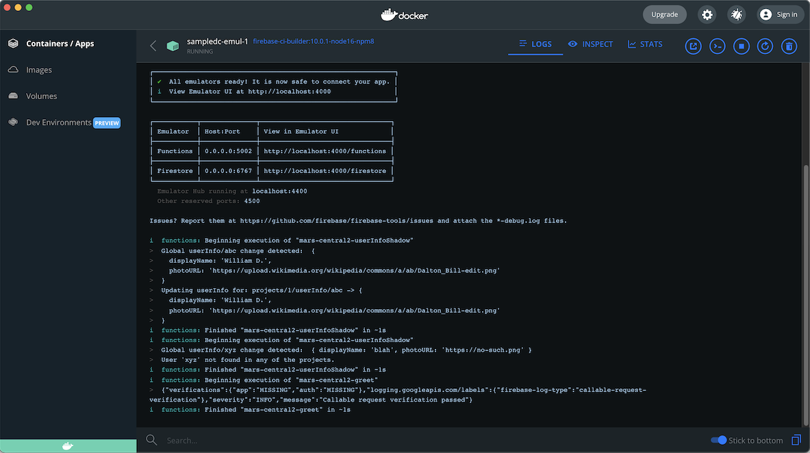

# Sample using Docker Compose

## Requirements

- Docker Desktop for Mac/Windows

	Recommended resources:
	
	- 2 cores
	- 2 GB RAM
	- 1 GB swap
	- 4 GB disk

>For Linux, a Docker installation with Docker Compose v2 [plugin installed](https://docs.docker.com/compose/cli-command/#install-on-linux).


## Starting the emulators

```
$ npm run start
...
Firebase Emulators are running. Use 'docker compose down' to run them down.
```

Unlike with the `npm run start` in the `sample` folder, here control returns to the command line. To see the emulators' console output, go to Docker > `Dashboard` > `Containers / Apps` > `sampledc` > `sampledc-emul-1`:



>**Warm-up**

>Since Firebase doesn't automatically warm up the emulators (i.e. the first tests are way slower than subsequent), there's a second container that does this, `sampledc-warm-up-1`.

>This helps us reach a predictable timeout of 2000 ms for all the tests.

Just as in the `sample` folder, you can now:

```
$ npm test
```

```
$ npm run test:fns:greet
$ npm run test:rules:project
```

The differences are:

- Firebase emulators run under Docker, not natively on your system (no `devDependency` on `firebase-tools`! 🥳 )
- Concurrency is handled with Docker Compose - no need for `concurrently`.

## Using in your own projects

Unfortunately, there's a compromise between maintainability of this repo - and the ease of taking this folder as a template for your own work.

If you look at the internals, there's a **lot** of details where things (eg. Docker Compose mappings) point to the normal `sample` folder. The author didn't want to duplicate the test definitions. This makes things look complicated, but they need not be.

If you decide to use Docker Compose for your project's testing, the suggestion is to first uncomplicate this folder, then use it as a sample.

- Remove references to `sample` by eg. moving folders like `test-fns`, `test-rules` here.
- ..so that eventually you'll be able to remove the whole `../sample` folder.

At this stage, test that the setup works:

- `docker compose down`
- `npm test`

Once the tests passes, you can use the folder as a template for your own work. :)

